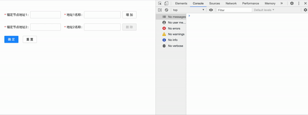

[](https://gitpod.io/#https://github.com/Quelle-0/Dynamic-Form)

# umi project

## Getting Started

Install dependencies,

```bash
$ yarn
```

Start the dev server,

```bash
$ yarn start
```

###### 效果图


###### 说明
这里只是将项目中的这个组件单独拿出来做了一个demo，方便下次需要时使用。后续可能会进一步完善。
